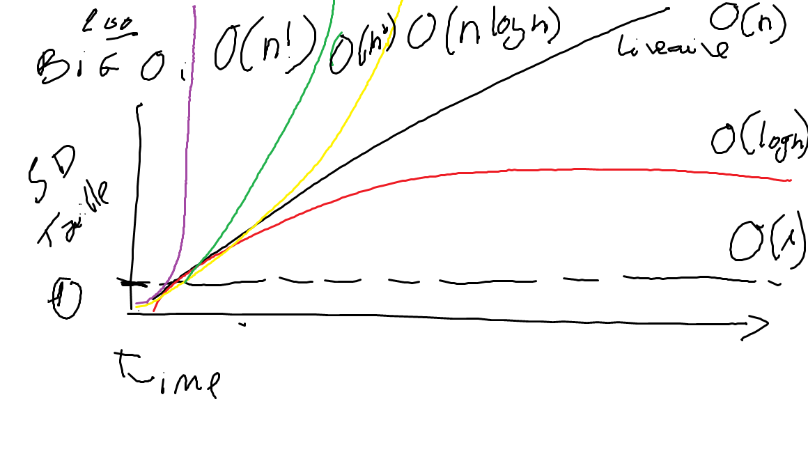
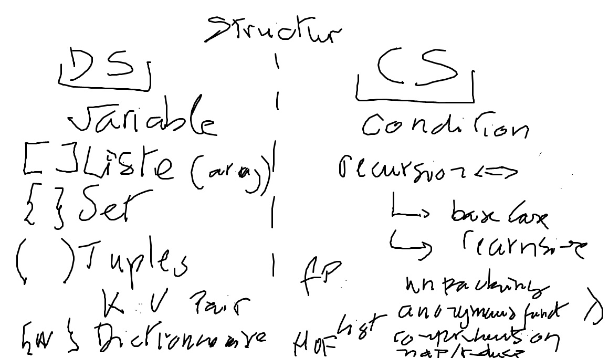

# Revision


:o: Big O Notation

</img>


:a: Structures

</img>


:one: Structure de donnees

* Variable

```
>>> x = 5
```

* Tuple

```
>>> x = ( 5, 'Oriane')
```

* Unpacking (Affectation multiple)

```
>>>  age, prenom = x
```


