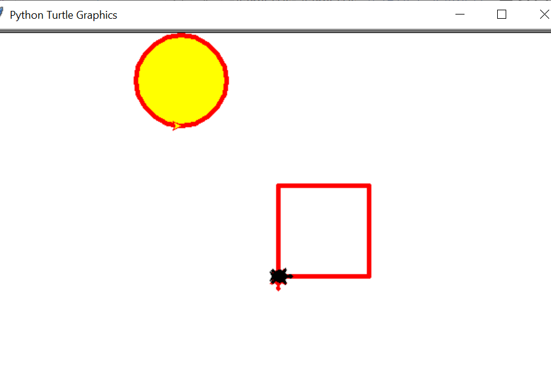

Mon projet est un projet de conception graphique à partir de Python Turtle Graphics

L'objectif final étant de créer à partir de Python Turtle Graphics, des graphiques tels que des cercles ou des carrées déterminés à partir du code Python. A la fin, j'ai rajouté un code qui permet de faire déplacer la TortueZack avec la souris pour la une promenade selon le curseur dela souris.
Le Python Turtle Graphic est un programme qui va s'ouvrir en dehors de Spider (j'ai utilisé Spider pour implémenter le code).

</img>

Le module tortue est un module intégré en python.
Il est utilisé pour créer des formes et des dessins 2D de base. Je le trouve convivial pour les débutants. Les principaux avantages de la tortue ici sont plusieurs : le graphique est simple et rend très facile les dessins à l'écran. Une fonction permet de faire bouger la tortue grâce à son écran.

Pour commencer à utiliser le module tortue, nous devons d'abord l'importer.
Ensuite, j’ai utilisé 4 commandes de base pour déplacer la TortueZack sur l'écran.
- .forward(pixels)
- .backward(pixels)
- .left(angle)
- .right(angle)

Deux autres méthodes très utiles sont:
- .penup ()
- .pendown ()

Nous utilisons ces méthodes pour quitter le stylo tortue, donc lorsque nous déplaçons l'objet tortue, aucune ligne n'est dessinée à l'écran.

Pour dessiner un cercle, nous pouvons utiliser:
- .circle (rayon)

Pour remplir des formes, nous devons utiliser .begin_fill () pour commencer le remplissage et un .end_fill () pour arrêter.
Le module tortue nous permet de détecter quand l'utilisateur a appuyé sur certaines touches du clavier ou déplacé / cliqué la souris. Chaque fois que l'utilisateur effectue une action en tant que telle, elle est appelée un événement. Nous pouvons écouter les événements et déclencher des fonctions à exécuter si nous «entendons» l'événement.

<html img src="TURTLE2.png" witdth="400" height="400"></img>

Événements de souris :

Nous devons maintenant créer deux fonctions qui seront utilisées pour effacer l'écran et déplacer la tortue.

def dragging(x, y):  
    t.ondrag(None)
    t.setheading(t.towards(x, y))
    t.goto(x, y)
    t.ondrag(dragging)

def clickRight():
    t.clear()

Nous allons maintenant configurer la fonction main qui exécutera notre programme.

def main():  
    turtle.listen()
    
    t.ondrag(dragging)  # permet de faire bouger la tortue
    turtle.onscreenclick(clickRight, 3)

    screen.mainloop()

<html img src="turtle3.png" witdth="400" height="400"></img>

