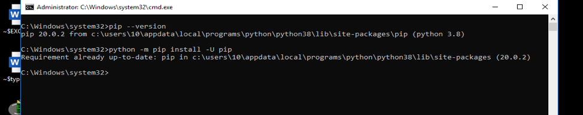
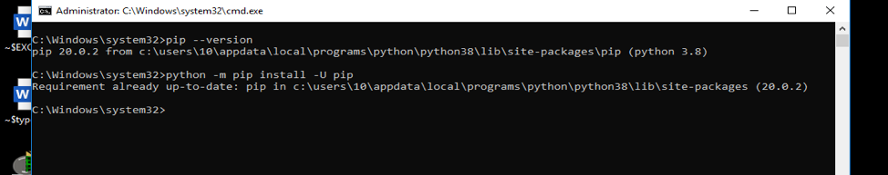

# Python Automation

j’ai Python3 sur mon ordinateur et je sais que PIP, Netmiko, Paramiko sont déjà installés sur cette version mais en ayant toujours des erreurs le moment d’exécuter des scripts que marchent dans les vidéos que regarde sur YouTube, j’ai décidé de les mettre en jours, mais j’aii toujours des problèmes le moment d’exécuter, j’arrive à ma destination avec Telnet mais les programmes marchent pas parfaitement, pourriez-vous m’aider dans ce dernier pas, j’ai sacrifié beaucoup de temps mais sans résultat

</img>

</img>
