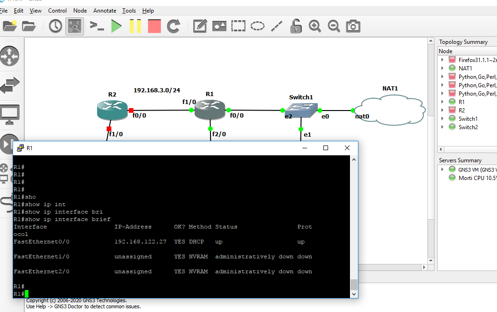
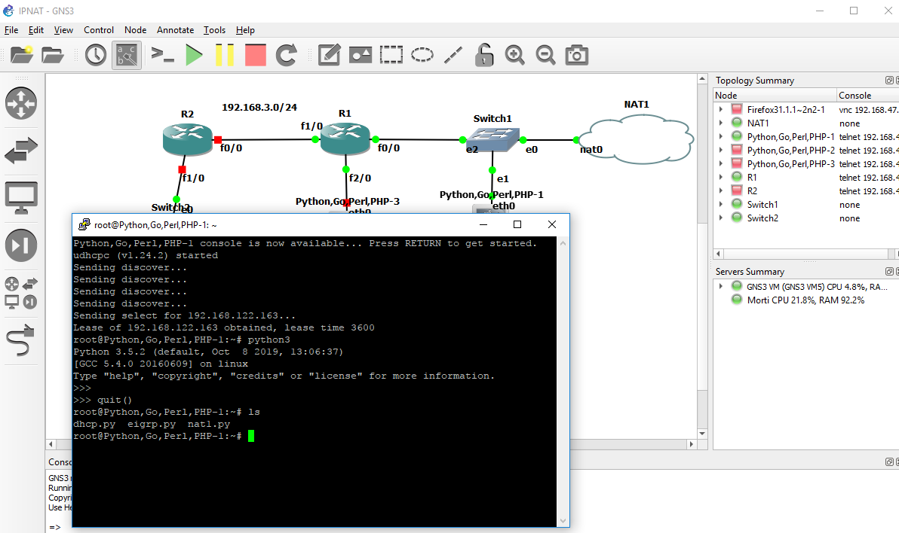
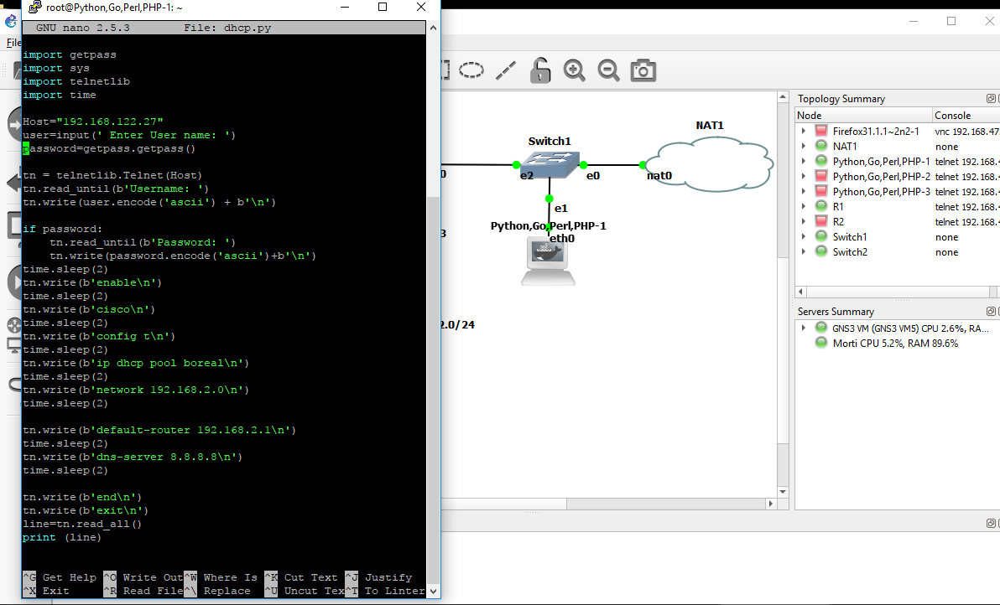
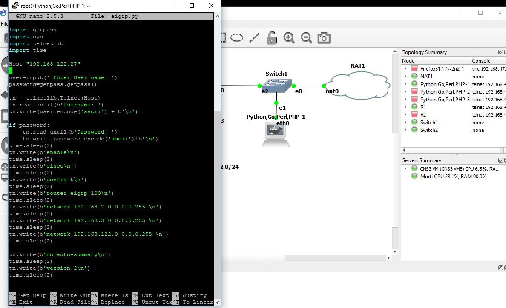
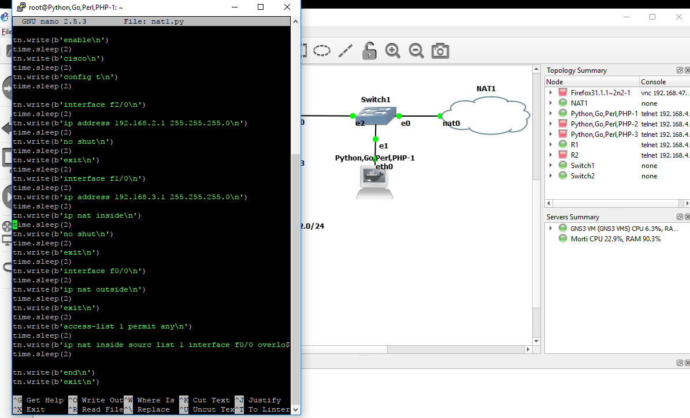
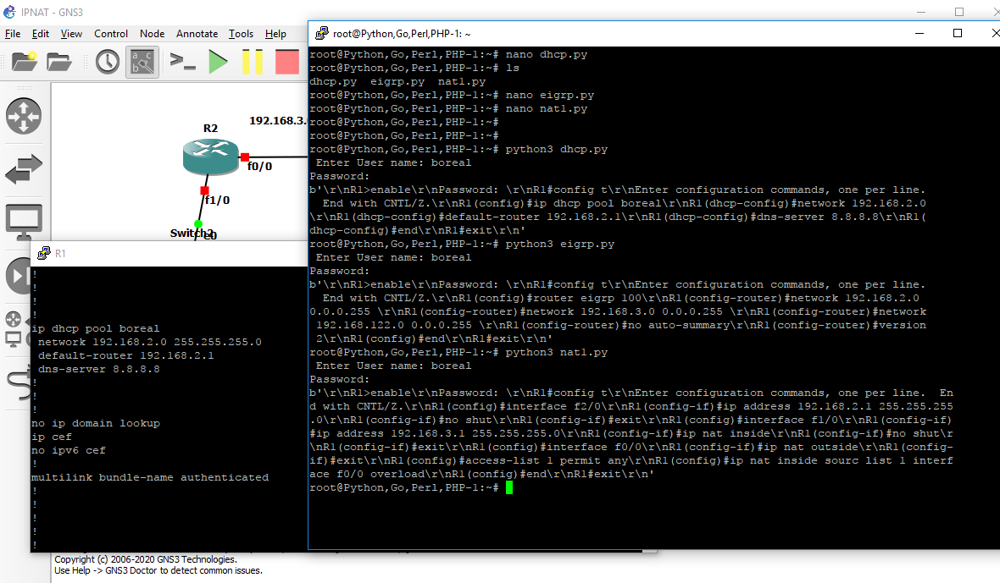

# Python Automation MORTEZA

</img>
Dans ce scénario on va configurer tous nos éléments de réseaux avec nos python scripts en utilisant python3 installé dans nos Docker Containers afin d’ouvrir le site de collège Boréal avec notre docker de Firefox.


</img>
R1 est notre routeur de pont entre Internet ou notre réseau local, pour cette raison on doit configurer NAT protocole. Sans NAT nos instruments locaux ne seront pas capables de sortir de notre réseau local. 
Pour vérifier si on est bien connecté à notre serveur virtuel pour sortir de ce réseau, on utilise la commande ip address dhcp dans l’interface f0/0. Si on obtient notre adresse IP ça veut dire que l’infrastructure est prête.

</img>
Ici vous pouvez vérifier qu’on a reçu notre adresse IP. 192.168.122.27. Nos python scripts configurent automatiquement ce routeur en utilisant cette adresse IP. 
Maintenant on va vérifier est-ce que notre Python Docker est connecté à notre serveur ou non.
Dans la photo suivante : 
Si notre Docker reçoit son adresse IP automatiquement par protocole de DHCP, ça nous assure qu’il est bien connecté. On peut aussi vérifier la version de notre python. En exécutant le commande ls vous pouvez voir les dossiers on a créés pour sauvegarder nos scripts dans ce Docker, et avec la commande de nano (nom de ce dossier) on peut voir son contenu.
Ici on va configurer DHCP,EIGRP et NAT aves ces scripts.
</img>
</img>
Avec ce script on va créer une piscine pour notre Docker connecté à l’interface f2/0 de R1.
</img>
Ici on va configurer notre EIGRP pour lier ce routeur avec les autre éléments de notre réseau.
</img>
NAT protocole pour qu’on puisse sortir de notre réseau local.

Exécuter nos scripts : 
</img>


</img>

1- INSTALLATION DE LA MACHINE VIRTUELLE
Pour créer votre lab afin d'automatisation il faut installer VMware Workstation Pro dans le Windows et Vmware Fusion dans le Mac.​

Dès que l'istallation c'est finie, vous devez installer GNS3 VM pour automatiser vos instruments de réseau avev GNS3, autremen dit, ça devient le serveur de vos machines dans votre GNS3 et ça vous aide d'utiliser un grand nombre de Docker Container préparés par GNS3.​

KVM support available doit étre vrai quand vous redémarrarez votre GNS3 VM, et vous devez aussi céer un autre addapteur dans cette machine dans le mode Pond.

 
 2-Installation de GSN3
 

Télécharger la dernière version dans le site www.gns3.com

Confiquer votre GNS3 pour le lier à votre GNS VM.

Télécharger des ISOs des différents instruments pour installer dedans.

Télécharger les différents Docker Container pour les utiliser dans vos travaux.

Quand vous lancez votre GNS3, votre serveur virtuel doit être vert(allumé).

3-PRÉPARER VOTRE PYTHON:

Il faut vérifier la version de votre Python dans cmd avec la commande.

 " python –version":

Python3 est prêt pour utiliser, mais pour python version 2 vous devez importer et installer get-pip.txt, Netmiko ou Paramiko pour le rendre capable d'exécuter les programme concernat de configurer vos instruments de réseau.

Ce sont tous mis dans python3.

4-RÉDIGER VOS PROGRAMMES :
 En général, chaque programme est constitué de deux parties, la promière c'est pour arriver à la destination, la euxième c'est pour la configurer, pour cette raison:

_Il faut préparer vos programme d'une manière que votre python puisse:

_Se connecter à la destination précise, arriver dans le mode de configuration et éxécurer le reste de programme en utilisant Telnet ou SSH et Address IP de la destination dans lequel vous avez activé Telnet ou SSH.

5-VÉRIFIER LA CONNECTION DANS VOTRE LAB:
Si: 

1-vous pouvez obtenir Address IP dans votre lab de votre machine virtuelle qui est votre serveur​

2- si vous pouvez pinguer vos instruments de cmd de votre ordinateur

3- si votre python est prêt

C'est le moment d'exécuter vos programmes et regardrer comment ça va simplifier la vie pour les informaticiens quui ont leurs programmes en mains pour configurer les instruments en cliquant un seul boutton.
 

## :one: Installation

```
PS > pip --version
```

</img>

```
PS > python -m pip install -u pip
```
</img>

```
PS > pip install netmiko
PS > pip install paramiko
```

</img>

## :two: Execution

C’est mon Ubunto Docker Container qui a reçu son adresse IP de DHCP :

</img>
